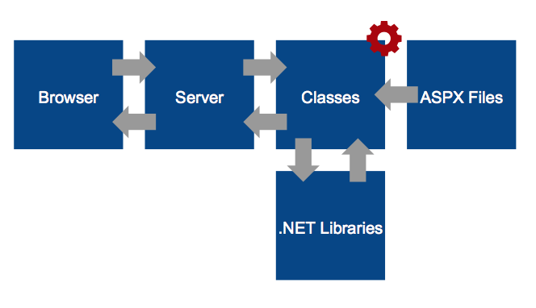
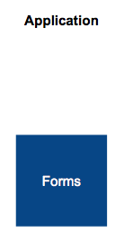
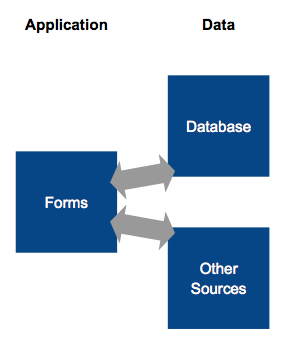
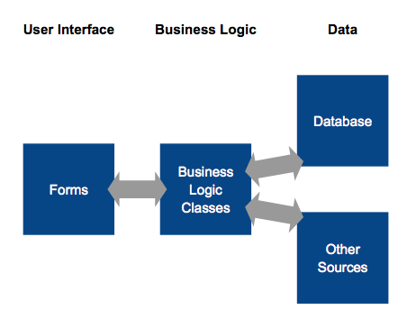
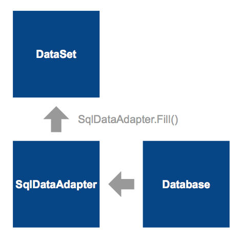
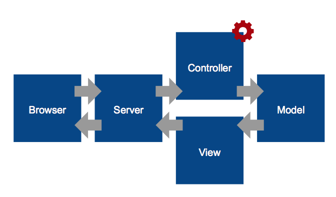

# .NET Review
- [.NET Review](#net-review)
    - [Lecture 1 Linq, enterprise dev practice](#lecture-1-linq-enterprise-dev-practice)
        - [Namespace naming conventions](#namespace-naming-conventions)
        - [LINQ Language INtegrated Query](#linq-language-integrated-query)
    - [Lecture 2 Testing and Refactoring](#lecture-2-testing-and-refactoring)
        - [test approaches](#test-approaches)
        - [Test Driven Development (TDD)](#test-driven-development-tdd)
        - [Dealing with dependencies](#dealing-with-dependencies)
    - [Lecture 3 ASP NET](#lecture-3-asp-net)
        - [ASP NET](#asp-net)
        - [Web Server](#web-server)
        - [ASP](#asp)
        - [ASP NET WebForms:](#asp-net-webforms)
        - [Web config](#web-config)
        - [Events](#events)
        - [State](#state)
        - [Redirect](#redirect)
    - [Lecture 4 More ASP NET WebForms and Architecture](#lecture-4-more-asp-net-webforms-and-architecture)
        - [Page life-cycle](#page-life-cycle)
        - [Life-cycle events](#life-cycle-events)
        - [Request and Response](#request-and-response)
            - [a note on testing](#a-note-on-testing)
        - [Redirect vs Transfer](#redirect-vs-transfer)
        - [Sessions and Cookies](#sessions-and-cookies)
        - [Authentication and Authorization](#authentication-and-authorization)
        - [Master pages](#master-pages)
        - [User controls](#user-controls)
        - [Application architectures](#application-architectures)
            - [1-tier](#1-tier)
            - [2-tier](#2-tier)
            - [3-tier](#3-tier)
            - [4-tier](#4-tier)
    - [Lecture 5 Data Access](#lecture-5-data-access)
        - [ADO NET](#ado-net)
        - [ADO NET Layers](#ado-net-layers)
            - [Connected Layer](#connected-layer)
            - [Disconnected layer](#disconnected-layer)
                - [Typed DataSets](#typed-datasets)
        - [Transactions](#transactions)
        - [DataReader vs DataSet](#datareader-vs-dataset)
    - [Lecture 7 Databases and Testing](#lecture-7-databases-and-testing)
        - [Integration Testing](#integration-testing)
        - [Mocking](#mocking)
        - [Encapsulation Strategies](#encapsulation-strategies)
    - [Lecture 8 Entity Framework](#lecture-8-entity-framework)
        - [Object-Relational Mismatch](#object-relational-mismatch)
        - [Object-relational mapping](#object-relational-mapping)
        - [DbContext](#dbcontext)
        - [CRUD](#crud)
        - [Creating a DbContext](#creating-a-dbcontext)
        - [Navigation Properties](#navigation-properties)
            - [Loading](#loading)
        - [Concurrency](#concurrency)
        - [Code First database migrations:](#code-first-database-migrations)
    - [Lecture 9 ASP NET MVC](#lecture-9-asp-net-mvc)
        - [MVC](#mvc)
        - [Filesystem vs HTTP](#filesystem-vs-http)
        - [Stages](#stages)
        - [Routing rules](#routing-rules)
        - [Form Fields](#form-fields)
        - [Views](#views)
        - [MVC vs WebForms](#mvc-vs-webforms)
    - [Lecture 10 ASP NET MVC Advanced](#lecture-10-asp-net-mvc-advanced)
        - [Model validation](#model-validation)
        - [Layout Master](#layout-master)
        - [Partial views](#partial-views)
        - [Authentication annotations](#authentication-annotations)
        - [Attribute routing](#attribute-routing)


## Lecture 1 Linq, enterprise dev practice

### Namespace naming conventions
```cs
CompanyName.TechnologyName[.Feature][.Subnamespace]
```
E.g.

```cs
Westdale.PlanManager.WebFrontEnd
```

### LINQ Language INtegrated Query
- SQL could be executed from C# using strings: `db.ExecuteSQL(@”some sql“);`

Advantages of LINQ:
- Behind the scenes conversion to SQL
- Works with non-SQL data sources as well

> LINQ queries are always executed **when the query variable is iterated over**, not when the query variable is created. This is called deferred execution.

Prerequisites for LINQ:
- Lambda expressions
- Implicit typing
- Anonymous types
- Extension functions

Delegates (Named method):
- Allows functions to be used as a variable
- Like function pointers but object oriented, type safe and can be associated with specific instance
- must matched with function return type and parameter numbers and types
```cs
public delegate string Formatter(int value)
public static string SthFormat(int value)
public static void foo(Formatter format){
  format(1);
}
foo(SthFormat);
```

Anonymous methods:
- unnamed methods, designed to be used with a delegate type.
- the compiler creates an ordinary method with an auto generated name
```cs
Main() {
  Formatter binary = delegate (int x)
  {
    return Convert.ToString(x, 2);
  };
  foo(binary);
}
```

Lambda Expressions:
```cs
Formatter binary = x => Convert.ToString(x, 2);
foo(binary);
```
- Read as “x goes to …” or “input x returns …”

Alternate syntax (Lambda):
```cs
Func<int, string> toBinary = x => Convert.ToString(x, 2);
Func<int, int, int> add = (x, y) => x + y;
Func<int, int, int> subtract = (int x, int y) => x - y;
Func<int, int, int> multiply = (int x, int y) =>
{
  int result = x*y;
  return result;
}
```

Anonymous types:
```cs
var user = new {Name = “Carol”, Age = 35};
```
- Use var
- No class name after new
- Properties names are used in braces {}, read only
- Compiler automatically generates a class of readonly properties

Implicitly typed variables:
- Use var, automatically inferred from the expression by compiler
- Variable is strongly typed
- Object Initializers:

```cs
var user = new User {FirstName = “Carol”, LastName = “Brady”};
```

Collection Initializers:
```cs
var names = new List<string> { “Mike”, “Carol”};
```

Extension Methods:
```cs
namespace MyExtensionMethod
{
  public static class StringConversions {
    public static double ToDouble(this string s) {
      return Double.Parse(s);
    }
  }
}

using MyExtensionMethod;
…
{
  {
    string myString = “6”;
    Console.WriteLine(myString.ToDouble());
  }
}
```
- A static method declared in a static class (first parameter is modified by “this”)
- Called as an instance method of a different class motivation
- “Add” methods to existing types without creating a new derived type
- Share “interface implementation”
- Allow capabilities to be extended (e.g. LINQ) with a simple using statement

what is the point?
- Extension methods allow interfaces (such as IEnumerable and IQueryable) to have implementation

LINQ:
```cs
var namesOfVoters = from c in db.Users
                    where c.Age >= 18
                    select c.LastName;
foreach (var name in namesOfVoters)
{
  Console.WriteLine(name);
}
```

LINQ can query:
- collections/arrays
- databases
- XML
- your own sources

LINQ method syntax:

```cs
var result = numbers.Where(x => x > 5).Select(x => x * x);
```

- the results are available as an IEnumerable<T> collection


[back to top](#net-review)
## Lecture 2 Testing and Refactoring

### test approaches
black box testing
- when we test the inputs and outputs, but do not look inside
- we check that the system follows its specifications

White box testing
- when we look inside the system as part of the testing
- use our knowledge of the system's internals to test the behaviour
we use **Unit tests, Automated, White box**

### Test Driven Development (TDD)
1. write an automated test that fails
2. write just enough code to get it passing
3. rafactor your code to imporve maintainability

how does this help?
- prevents over-engineering and adding untested behaviours

.NET testing with MSTest:

```cs
[TestClass]
public class UsersTests
{
  [TestMethod]
  public void FullName_Male_StartsWithMr(){
    User user = new User ("Mike", Gender.Male);
    Assert.IsTrue(user.FullName().StartsWith("Mr"), "error msg");
  }
}
```

Test naming convention
- tests for MyProject -> MyProjectTests
- tests for MyClass -> MyClassTests
- individual tests are named [Unit]\_[State]\_[Result]

E.g.
```cs
CalculatorTests::
DivisionTests::
Dividing_FourByZero_Errors
```

Alternate convention
- tests for MyProject -> MyProject.UnitTests
- tests for a unit of work with a spcific state in StateUnderTest
- tests for individual behaviours are simply the behaviour name

E.g.

```cs
Calculator.UnitTests::
DivisionOfTwoNumbers::
Should_throw_an_exception_when_dividing_by_zero
```

Test setup:
`[TestInitialize]` will run before **every** test method

Testing for Exceptions:
`[ExpectedException(typeof(DivideByZeroException))]`
the test will fail if an exception **doesn't** occur

### Dealing with dependencies
your code will often have dependencies on other classes
- file system classes
- database access classes
- web service classes

one appraoch
- class under test uses interface to dependency
- write a dummy interface implementation for testing only
- test code 'injects' fake class
- tests run using the fake class

[back to top](#net-review)
## Lecture 3 ASP NET

### ASP NET
Active Server Pages (ASP).NET
Three Models
- WebForms
  - GUI oriented, using 'forms' and 'controls'
  - a stateful application abstraction over web development
- MVC (Model View Controller)
  - doesn't hide the stateless nature of the web
- Web API
  - supports REST/HTTP APIs
  - very similar approach to MVS

### Web Server
browser <-> server
- HTTP protocol
- TCP port 80 or 443 for HTTPS

Serving static content:

**browser <-> server <-> HTML files**

ASP.NET:



### ASP
Classic ASP (inline) style:
```html
<%@ Page Language="C#" %>
<!DOCTYPE html>
<html>
  <body>
    <%
      if (Test())
      {
    %>
      Hello, <%= Expression() %>
    <%
      }
    %>
  </body>
</html>
```

### ASP NET WebForms:
ASPX:
```html
<%@ Page Language="C#"
    AutoEventWireup="true"
    CodeBehind="User.aspx.cs"
    Inherits="WebApplication.User"  %>
    <!DOCTYPE html>
<html>
<body>
<form runat="server">
        <asp:TextBox ID="FirstName" runat="server">
            </asp:TextBox>
        <asp:Button ID="Button" runat="server"
    </form> Text="Save" OnClick="Button_Click" />
</body>
</html>
```

- server-side controls have a `runat="server"` attribute
- standard ASP.NET controls are prefixed with `asp:`
- server-side event handlers can be defined in the ASPX

Code behind:
```cs
using System;
using System.Web;
using System.Web.UI;
using System.Web.UI.WebControls;
using System.Diagnostics;
namespace WebApplication
{
  public partial class User : System.Web.UI.Page
  {
    protected void Page_Load(object sender, EventArgs e)
    {      
      // initialization
    }
    protected void Button_Click(object sender, EventArgs e)
    {
      Debug.WriteLine(FirstName.Text);
    }
  } 
}
```

- a partial class
- `Page_Load` is called before each page request
- `Button_Click` is called whenever the button is clicked

Designer Class:
- another partial class auto generated by Visual Studio
- it declares the user control

### Web config
```xml
<appSettings>
  <add key="ValidationSettings:UnobtrusiveValidationMode" value="None"/>
  <add key="MinimumBalance" value="150"/>
</appSettings>
```
```cs
using System.Web.Configuration;
...
string minimumBalanceString = WebConfigurationManager.AppSettings["MinimumBalance"];
int minimumBalance = int.Parse(minimumBalanceString);
```

why is this useful?
- WebConfigurationManager is typically used in web applications where it may deal with hierarchies of web.config files
- the configuration files are on a per-project basis
- a separate App.config file would be needed if used in unit test project

### Events
Multicast events
```cs
Button.Click += Button_Click;

// behind the scene declarations
// in System namespace
public delegate void EventHandler(object sender, EventArgs e);
// in the System.Web.UI.WebControls.Button class
public event EventHandler Click;
```

### State
- Session
  - SessionState is persisted on the server for each browser session
- ViewState
  - ViewState is sent between the server and client on every request

store value in the Session and ViewState object:
```cs
Session["somekey"] = 123;
int value = （int) Session["somekey"];
```

### Redirect
```cs
Response.Redirect("Other.aspx");
Server.Transfer("Other.aspx");
```

`Response.Redirect` is more preferred as `Server.Transfer` does the redirect on the server so may result in misleading URLs
e.g. A request to PageA.aspx, if transferred to PageB.aspx will retain the URL of PageA.aspx.

[back to top](#net-review)
## Lecture 4 More ASP NET WebForms and Architecture

### Page life-cycle
High Level understanding:
- requested received
- object instantiated
- page set-up
- `Page_Load` is called
- control events are fired
- response is sent to user

Full page life-cucle:
- Page request
- Start
  - PreInit
- Initialization
  - Init
  - InitComplete
  - PreLoad
- Load
  - Load
- Postback events
  - Control events
  - LoadComplete
  - PreRender
  - PreRenderCoimplete
  - SaveStateComplete
- Rendering
  - Render
- Unload
  - Unload

### Life-cycle events
Three approaches
- AutoEventWireup
```cs
protected void Page_Load(object sender, EventArgs e)
```
if .aspx file having `AutoEventWireup="True"` define in the `<%@Page %>` tag, can write custom event handlers, just by defining a function prefixed by `Page_`
- Delegates
```cs
Load += Listner;
```
programmatically wire up a delegate using event handlers, but may need to do this early (e.g. in constructor)
- Virtual methods
```cs
protected override void OnLoad(EventArgs e)
{
  base.OnInit(e);
}
```
directly override the event methods in `System.Web.UI.Page`, however, it is important to call the base event, otherwise the page may not be rendered properly

### Request and Response
- instance of each is available in a Page
- Request
  - HTTP GET/POST request properties
  - Query string, cookies, parameters
- Response
  - Send HTTP response properties
  - Redirects, cookies, HTML, headers

```cs
// Request
Request.Headers["User-Agent"];
Request.HttpMethod;
Request.Params["Name"];

//Response
Response.Write("<h3>Hello world!</h3>");
Respose.ContentType = "text/plain";
Response.Headers.Add("Debug-Info", "v1.0");
Response.Redirect("Welcome.aspx");
```

#### a note on testing
- Request and Response both interact with HttpContext
- all are static objects
- it is very hard to stub/mock a static object
- tips for unit testing with WebFormsL
  - separate business logic from the page
  - encapuslate interactions with Request and Response
  - consider using an MVP(Model-View-Presenter) pattern (advanced)

### Redirect vs Transfer
`Response.Redirect("Other.aspx")`
- causes HTTP Code 302 to be sent
- browser then requests the page
- all form values, etc from current page are lost

`Server.Transfer("SomePage.aspx")`
- direct transfer (no new request from browser)
- form values can be preserved if required
- URL in browser is unchanged

### Sessions and Cookies
Cookies
- a text file stored on the **client's** computer by the web browser
- the web site uses the cookie to store information about the user
- sent with each request from the user to the web site
- sent as a HTTP header

```cs
HttpCookie cookie = new HttpCookie("user", "Cindy");
cookie.Expires = DateTime.Now.AddMinutes(10.0);
Response.SetCookie(cookie);

Request.Cookies["user"].Value;
```

Limitations:
- can only store strings
- can be disabled by the user
- at least (at most) 300 cookies total
- at least (at most) 4096 bytes per cookie
- at least (at most) 20 cookies per domain

HttpSessionState
- available in every page via `Session`
- stores objects by key (name-value pairs)
- Use cookies behind-the-scenes `ASP.NET_SessionId=...;`
- Fall-back to URL encoding

ViewState
- `ViewState` is similar to `Session`
- implemeted as a hidden form variable (doesn't depend on cookies)
- available on post back (not sessions)
- is transferred with every requet and respose

### Authentication and Authorization
Authentication strategies
- no authentication
- individual user accounts
for general public
- organizational accounts
use with Active Directory
- windows authentication
for small Local Area Network

Authentication technologies
- membership (old)
- identity (new)
- cookie authentication

when first login, login credentials are checked and authentication information is added to browser cookie, so no need to sent credential with every request

Authentication concepts
- Users - individual
- Roles - category
- Claims - store user information
- Authentication - who are u
- Authorization - what r u allowed to do

Getting the current user:
used the `User` Proerty of `System.Web.UI.Page`
```cs
User.Identity.Name
User.IsInRole("Admin")
```

Protecting files/directories:
in web.config
```xml
<location path="Admin.aspx">
  <system.web>
    <authorization>
      <allow roles="Admin"/> 
      <deny users="*" />
    </authorization>
  </system.web>
</location> 
```

- the asterisk (*) means "everyone"
- the question mark(?) means "unauthenticated users"

### Master pages
- use master pages to achieve a common look and feel
- master pages use placeholder tags for positioning nested content
- content pages "inherid" common GUI elements from master pages
- known as "visual inheritance"

Master:
```html
<%@Master Language="C#" %>

<asp:ContentPlaceHolder ID="Main" runat="server"/>
```

Content Pages:
```html
<%@Page Language="C#" MasterPageFile="Site.Master" %>

<asp:Content ContentPlaceHolderID="Main" runat="server">
  Welcome!
</asp:Content>
```

### User controls
web applications often reuse functionality on multiple pages:
- user controls (ASCX) can achieve this
- custom components can be embedded like ordinary components

```html
<%@Control Language="C#" CodeBehind="MyControl.ascx.cs" Inherits="App.MyControl" %>

<asp:TextBox ID="FirstName" runat="server"></asp:TextBox>
<asp:TextBox ID="LastName" runat="server"></asp:TextBox>
```
Content Pages:
```html
<%@Page Language="C#" %>

<%@ Register Src="~/MyControl.ascx" TagPrefix="uc" TagName="MyControl" %> 
<uc:MyControl ID="UserDetails" runat="server"/>
```
### Application architectures
#### 1-tier



Advantages
- Extremely simple

Diadvantages
- difficulty in re-using code if presentation method needs to be changed
- testing is more complex
- difficult to share functionality
- functionally unrelated code is contained in a single class
- no shared data

#### 2-tier



Advantages
- Conceptually simple
- Shared data

Disadvantages
- diffculty in re-using code if presentation method needs to be changed
- testing is more complex
- difficult to share functionality
- functionally unrelated code is contained in a single class

#### 3-tier



Advantages
- easier testing
- easier to modify user interface
- more scalable
- data access classes can be shared with other applications

Disadvantages
- More complex

#### 4-tier


Advantages
- best for testing
- more scalable
- interface classes are only responsible for displaying data (easy to change interface)
- one place to change business logic
- business and data access functions can be chared easily

Disadvantages
- more complex
- less support from IDE tools

[back to top](#net-review)
## Lecture 5 Data Access
### ADO NET
- a set of base classes/interfaces and optimized implementations of those interfaces
- e.g. to access an SQL server database, you would use the ADO.NET data provider that is optimized for SQL server

```cs
var settings = System.Configuration.ConfigurationManager.ConnectionStrings["Db"]; 
DbProviderFactory factory = DbProviderFactories.GetFactory(settings.ProviderName); 
DbConnection conn = factory.CreateConnection(); 
conn.ConnectionString = settings.ConnectionString;
conn.Open();
```

### ADO NET Layers
- connected
  - the connected layer maintains a database connection while working with the database
  - the traditional approach to interfacing with database
  - closely matches the low-level interfaces that most database provide
- disconnected
  - the disconnected layer creates an in-memory copy of part of the database
  - designed to conserve connections, increase performance and also reduec programmer errors in managing conections
- object-relational (EntityFramework)
  - in-memory view of the database
  - however, it is not relational - it does not have tables and columns
  - instead it automatically translates tables into ordinary objects

#### Connected Layer
- DbConnection (SqlConnection)
- DbCommand (SqlCommand)
- DbataReader (SqlDataReader)

Querying the database
- create a connection
- open the connection
- create a command
- execute the command
- read the result
- close the connection

Create a connection:
- select a data provider (e.g. `System.Data.SqlClient`)
- create a connection instance
- pass a connection string to configure the connection

Connection strings:
-  are preferably stored in .config files

```xml
<connectionStrings>
<add name="Db"
  connectionString="Data Source=(LocalDB)\v11.0;Integrated Security"
  providerName="System.Data.SqlClient"/>
</connectionStrings>
```
```cs
using System.Configuration; 
ConfigurationManager.ConnectionStrings["Db"].ProviderName 
ConfigurationManager.ConnectionStrings["Db"].ConnectionString
```

Commands:
```cs
SqlConnection c = new SqlConnection();
c.ConnectionString = connectionString;
c.Open();
string query = "select count(*) from Customers";
SqlCommand command = new SqlCommand(query);
command.Connection = c;
Response.Write(command.ExecuteScalar().ToString()); 
c.Close();
```

Using `using`:
```cs
using (SqlConnection c = new SqlConnection())
{
  c.Open();
  ....
  // c.Close(); no need
}
```

- the `using` statement automatically ensures that connections are closed
- it could be used with any class that implements `IDisposable`

Command:

four methods to execute commands:
- `ExecuteScalar` - when the query will return single value
- `ExecuteReader` - Select statements, returns a  `DbDataReader`
- `ExecuteNonQuery` - insert, delete, update statements, not results
- `ExecuteXMLreader` - for handling XML from SQL server

DataReader:
- read only, forward only data stream
- useful when you only need to access data once
- retains a database connection

```cs
using (SqlDataReader result = command.ExecuteReader())
{
  while (result.Read()) 
  {
    Console.WrilteLine(result.GetString(0));
    Console.WrilteLine(result.GetInt32(1));
  }
}
```

Parameters:
```cs
string query = @"select FirstName, LastName
                  from SystemUser
                  where LastName = @name";
Sqlcommand command = new SqlCommand(query, conn)
command.Parameters.Add(new SqlParameter("name", "Robert"));
```

#### Disconnected layer
why?
- memory is cheap and fast
- database connections are slow and resource consuming
- simple and clean
- ensures that connections are closed quickly
- allow results to be cached easier
- reduce the possibility that connections are not closed

Disconnected Layer:
- `DataSet` - an "in-memory" database
- `DataTable` - a table in the `DataSet`
- `DataRow` - a row of a `DataTable`
- `DataAdapter` - connects a `DataSet` to a database

Querying with DataSets:
- create `DataAdapter` with SQL string and connection
- create a new `DataSet`
- fill dataset using `DbDataAdapter.Fill(dataset`
- process or display DataSet 'offline'



```cs
DataSet result = new DataSet();
string query = "select FirstName, LastName, DateOfBirth from SystemUser"; 
SqlDataAdapter adapter = new SqlDataAdapter(query, connectionString); 
adapter.Fill(result);
// First table, first row, first column
Console.WriteLine(result.Tables[0].Rows[0][0]);
```

Updating with DataSets:
- make changes to `DataSet`  
- update database using `DbDataAdapter.Update(dataset)`
- Note:
  - you need to specify the update queries (`DbDataAdapter.UpdateCommand`)
  - However, `SqlCommandBuilder` can do this automatically

##### Typed DataSets
- simply a custom subclass of `DataSet`/`DataTable`

```cs
SystemUserTable users = new SystemUserTableAdapter().GetData();
```

### Transactions
Group database updates into a single unit
- 'All or nothing'
- isolation
- e.g. Bank account transger
- use `DbTransaction (SqlTransaction)`

```cs
// BeginTransaction returns an instance of DbTransaction
var tx = connection.BeginTransaction();
tx.Commit();
tx.RollBack();
tx.Close();

// actual usage
using (var tx = conn.BeginTransaction())
{
  var c1 = new SqlCommand(update1, conn, tx);
  c1.ExecuteNonQuery();

  var c2 = new SqlCommand(update2, conn, tx);
  c2.ExecuteNonQuery();

  tx.Commit();
}
// the code will be run 'all or nothing'
// if either command fails, then both will be cancelled
```

### DataReader vs DataSet
- DataSets are very easy to use and reduce errors
  - however it create a tendency to use them pervasively throughout an application
  - this may be a problem if you want your design to be independent of the relational database
- while DataReaders are more difficult to work with, their low level abstraction may encourage better separation and isolation

[back to top](#net-review)
## Lecture 7 Databases and Testing
Broadly, there are 2 approaches
- Integration testing
- Mocking data access classes

### Integration Testing
- test that the method really does add data to the database
- perform testing on the database and checked whether data is modified as intended
- some strategies for controlled integration testing:
  1. set the database into a known state before the tests and ensure that at the end of a test, the result is reversed; this can be achieved in code or using a **transaction**
  2. set the database into a known state before every test
  3. use an in-memory database or copy a database file before every test

### Mocking
- use a mocking framework to construct 'fake' data access objects
- generate fake data/records
- require that methods be called with certain parameters

```cs
[TestMethod]
public void PackageReceived_BarcodeExists_LocationUpdates()
{ 
  Mock<PackageTableAdapter> adapter = new Mock<PackageTableAdapter>();
  adapter.Setup(x => x.UpdateLocation("Brisbane", "123")).Returns(1);
  
  Location manager = new Location("Brisbane", adapter.Object);
  Assert.IsTrue(manager.PackageReceived("123"));
 
  adapter.Verify(x => x.UpdateLocation("Brisbane", "123"));
}
```
couple extra points:

> mocking test on data access objects could be less useful when not using DataSets or Typed DataSets
> it would be testing the implementation rather than the behaviour of the application, and any change to the implementation requires a change to the tests
> thus, an integration test is likely to be best with when testing data access layer implemented using the ADO.NET connected layer
> However, once it's tested, can then use mock objects for unit testing in business logic layer

### Encapsulation Strategies
Follow a design pattern to isolate persistence concerns from business logic
- Data Access Objects (DAO)
- Repository Pattern
- Unit Of Work Pattern

a DAO support CRUD operations at a low level of abstraction

[back to top](#net-review)
## Lecture 8 Entity Framework
### Object-Relational Mismatch
Challenges:
- “When data has a **relational** structure, data access, storage, and scalability are very efficient, but writing efficient and maintainable code becomes more difficult.”
- “When data has an **object** structure, the trade-offs are reversed: writing efficient and maintainable code comes at the cost of efficient data access, storage, and scalability.”

Objects have
- independent identity
- references instead of foreign keys
- private state
- methods

Relations have
- value-semantics
- uniqueness/identity tracked via the primary key
- designated primary keys
- foreign keys
- durability (and other ACID properties)

### Object-relational mapping
- database records are automatically mapped to objects
- these objects referred to as "entities"
- usually a 1:1 mapping from record to entity
- capture the database conceptual model
- the mapping is not perfect

### DbContext
- DbContext
  - simplified wrapper for ObjectContext
- ObjectContext
  - Manages connection to the DB
  - Exposes entity sets for data querying
  - Tracks changes to entities
  - commits those changes to the DB
- DbSet
  - a collection of entities in a context
  - add/remove from the set are translated to database insert/delete

```cs
// Instantiate a context
using (CallEntities context = new CallEntitites())
{
  // Query a DbSet
  var femaleCustomers = 
      from customer in context.Customers
      where customer.Gender == (int) Gender.Female
      select customer.FirstName;
  // Iterate through the results
  foreach (var name in femaleCustomers) {
    Console.WriteLine(name);
  }
}
```

### CRUD
Create:
- create a new instance of the entity
- add the entity to the `DbSet`
- call `DbContext.SaveChanges()`
```cs
// Create the customer
var customer = new Customer
{ 
  FirstName = "Kevin",
  LastName = "Brady",
  Gender = (int)Gender.Male,
  DateOfBirth = new DateTime(1981, 1, 15)
};
// Add to the DbSet
context.Customers.Add(customer);
// Save the changes to the database
context.SaveChanges();
```

Read:
- use LINQ on the `DbContext/DbSet`
```cs
var femleCustomers = from customer in context.Customers
                      where customer.Gender == (int) Gender.Female
                      select customer.FirstName;
```
- use LINQ query builder methods
```cs
var femaleCustomers = context.Customers
                      .Where(c => c.Gender == (int)Gender.Female)
                      .Select(c => c.FirstName);
```
- use Entity SQL (rarely used and discouraged)
```cs
IObjectContextAdapter oc = context;
var users = new ObjectQuery<Customer>(
        @"select value p
          from Customers as p
          where p.Gender == 0", oc.ObjectContext
);
```

Update:
- fund the entity in the `DbSet`
- Modify th entity
- call `DbContext.SaveChanges()`
```cs
var carol = (from customer in context.Customers
              where customer.FirstName == "Carol"
              && customer.LastName == "Martin"
              select customer).First();
// Modify the entity
carol.LastName = "Brady";
// Save changes
context.SaveChanges();
```

Delete:
- remove the entity from the `DbSet`
- call `DbContext.SaveChanges()`
```cs
// Find the customer
var kevin = (from customer in context.Customers
              where customer.FirstName == "Kevin"
              && customer.LastName == "Brady"
              select customer).First();
// Remove from the DbSet 
context.Customers.Remove(kevin); // use RemoveRange for a list of entity
// Save the changes to the database
context.SaveChanges();
```

### Creating a DbContext
2 approaches:
- Database/Model first
> Database first = Use an existing database and let visual studio generate the database model
> Model first = Create a new database or a conceptual design and visual studio will generate the database schena
- Code first
> Code first = Write OO code and let Entity Framework generate a database schema
> database will be automatically generated when first persist changes in application

```cs
// Code-first demo
public class Customer
{
  // Primary key and identity
  [Key] 
  [DatabaseGeneratedAttribute(DatabaseGeneratedOption.Identity)] 
  public int CustomerId { get; set; }

  // Not null, database column and type specified 
  [Required]
  [Column("FirstName", TypeName="nvarchar(100)")] 
  public string FirstName { get; set; }

  [Required]
  public string LastName { get; set; }

  // Navigation property (many-to-one) 
  // notice the virtual
  public virtual Address Address { get; set; }

  // Navigation property (one-to-many) 
  [InverseProperty("CustomerCalled")]
  public virtual ICollection<Message> Calls { get; set; }

  // not stored in the database
  [NotMapped]
  public string FullName
  {
    get {return Firstname + " " + LastName;}
  }
}

// the context is easy to implement:
public class CustomerEntities: DbContext
{
  public Model(): base("CustomerCalls")
  {
  }

  // notice the virtual
  public virtual DbSet<Customer> Customers {get; set;}
}
```

### Navigation Properties
- Relations/foreign keys are converted to properties in .NET
- add/delete from the navigation property to modify the database

```cs
// Find the customer
var carol = (from customer in context.Customers
              where customer.FirstName == "Carol"
              && customer.LastName == "Brady"
              select customer).First();
// View the calls
foreach (var call in carol.Calls) {
  Console.WriteLine(call);
}
// Add a new call
var newCall = new Call {
  StartTime = new DateTime(),
  Notes = "Customer was not interested"
};
carol.Calls.Add(newCall);
// Save the changes to the database
context.SaveChanges();
```

#### Loading
- Lazy Loading (default)
  - entity framework queries the database when you use a navigation property of an entity
- Eager Loading (.Include)
  - entity framework queries the database for the navigation property when you **retrieve the entity**
- No Loading
  - entity framework ignores navigation properties

for lazy loading to work, the properties need to be virtual, this is because entity framework generates a subclass of entity class and will have a method that queries the underlying database

### Concurrency
- optimistic
  - conflicts rarely happen
  - deal with them
  - approach taken by EF
- pessimistic
  - conflicts should never happen
  - lock the database

```js
add something later
```

### Code First database migrations:
- the database is created from code
- changes in code don't update the schema
- use migrations to 'evolve' database with code

[back to top](#net-review)
## Lecture 9 ASP NET MVC
### MVC
Problem with ASP.NET Forms:
- compiled ASPX file combiles both the view handling code as well as view logic
- they aren't separated
- difficult to write unit tests
- difficult to reuse logic across multiple views

ASP.NET MVC:



- controller is responsible for creating or modifying the model
- model is then passed to the view
- view then renders HTML for the user

Rationale:
- view management is less abstract than ASP.NET Forms
- "Closer" to HTML
- Request routing based on HTTP rather than file system
- Control over content types (HTML, XML, JSON)
- Supports AJAX and rich UIs
- Easier to test and maintain
- Cleaner markup
- Industry trend

### Filesystem vs HTTP
```
// WebForms
GET /ProductInfo.aspx?id=332
// MVC
GET /Products/332
```

in terms of MVC being cloase to the underlying HTTP protocol, consider how requests are handled:

in forms, a URL is a request for a specific view/form, the URL reveals the underlying file structure of the application

MVC uses configurable mappings between URLs and actions, this means that the URL can represent the logical structure of your domain

### Stages
- Page request
- Routing - path is decomposed: controller and action are identified
- Controller invocation - the controller action is invoked: ViewResult returned
- View Rendering - the appropriate view is rendered by view engine
- Response returned

### Routing rules
default routing rule:
> http://www.example.com/Product/List

is parsed using: /{controller}/{action}
> controller = `Product`, action = `List`

the routing rules normally appear in RouteConfig.cs

Controller invocation:
> controller = `Product`, action = `List`

becomes
> `new ProductController().List()`
any other parameters configured in the URL are passed as parameters to the action method

View Rendering:
> `ViewResult List() { return View(); }`

invokes the Razor view enginer on:
> `Views/Product/List.cshtml`

by convention, a view will be chosen by searching for a Razor file in the Views folder that corresponds to a controller and action, and by convention, the razor file will be a file with the same name as the action and a folder with the same name as the controller

this default behaviour can be overrider by passing paramerest to `View()`

> e.g. `View("Secondary")` will use the view in `Views/Product/Secondary.cshtml`

the model is passed as a parameter to view
```cs
View(model);
View("Secondary", model);
```

Routing:
- Convention over Configuration
- Parameters
  - Query strings are passed as parameters to controller methods
  - `/Product/Search?name=Table` maps to `ProductController.Search("Table)`
  - `/Product/View/6` maps to `ProductController.View(6)`

Controller actions:
- can return any type or void
- Convention is to return `ActionResult` or one of its descendants:
  - `FileResult` - returns a fule or binary data for download
  - `ViewResult` - uses Razor to render a view using the supplied model
  - `JSONResult` - return JSON (e.g. for AJAX callbacks)
  - `ContentResult` - plain text
  - `RedirectToRouteResult` - navigates to another part of the app (HTTP 302 redirect), can also yse RedirectToAction to create a RedirectToRouteResult
  - `HttpUnauthorizedResult` - return a HTTP 403 denied

### Form Fields
POST and GET parameters are available via:
- `Request.QueryString["name"]`
- `Request.Form["name"]`
- Named arguments: `Action(string name)`
- Model Bindings: `Action(Person person)`

better let MVC do automatic binding instead of manually retrieving

### Views
- provide the UI
- are supplied with a model by the controller
- take data from the model to embed in the HTML
- are located in the Views folder (by convention)
- each controller has a corresponding filder in the Views filder containing views for each controller method
- can be written in Razor (cshtml) or ASP (aspx)

Passing parameters to a view:
- using `ViewBag`:
  - Set in C#
  - `ViewBag.Name = "Carol"`
- Read from Razor (cshtml):
  - `@ViewBag.Name`

can set any properties to ViewBag, whenever it's set, it is created on the object; howeverm there are no compile time checks to ensure correct name or type is used, thus it isn't a good practice to use in production

Passing a model to a view:
- Set in C#
  - `return View(new Person { Name = "Derek"}; )`
- Read from Razor (cshtml)
  - `@model MVCApplication.Person`
  - `<p>Your name is @Model.Name</p`

View Models:
- used when information required does not map to a single model class
- create a specific model to contain information -> a "ViewModel"

### MVC vs WebForms
- will it be a public website or an intranet site?
  - MVC lets you have more control over the HTML so might be preferred for a public website
- how much time do you have?
  - Forms can be a lot faster to develop for simple sites
- Do u need to create custom URLs?
  - MVC makes this easier
- Do u have existing GUI code?
  - Forms is closer to traditional GUI development
- Do u need to use lots of custom JavaScript/AJAX?
  - MVC will make this easier
- Do u need to use rich server-side controls?
  - Forms has Calendar, GridView, reporting and many other powerful controls that just drag and drop

[back to top](#net-review)
## Lecture 10 ASP NET MVC Advanced
### Model validation
- automatic
- based on annotations (attributes) on model
- Check `ModelState.IsValid` in controller
- use the HTML helper in razor to shor error messages:
  - `@Html.ValidationSummary()`
  - `@Html.ValidationMessageFor(...)`
- Validation Annotations:
  - `[Required]`
  - `[RegularExpression]`
  - `[Range]`
  - `[MaxLength]`
  - `[MinLength]`
  - `[Compare]`
  - `[EmailAddress]`
  - `[Phone]`
  - `[StringLength]`
  - ...
- Placed on properties

### Layout Master
```html
<html>
<body>
  <h1>Here is the body:</h1>
  @RenderBody()
  <h2>Here is a section:</h2>
  @RenderSection("Section", false)
</body>
</html>
```
Similar to ASP.NET Form Master Pages and User Controls
-> MVC Layouts and Partial View

Using layouts:
```html
@{
    Layout = "~/Views/_Base.cshtml";
}
<div class="content">This is the body</div>
@section Section {
    <p>This is a section named "Section"</p>
}
```
- used by setting the `Layout` property of the Razor view
- any part of the view defined in a `@section` becomes a section
- any text not defined in side a `@section` is the body

### Partial views
- include another view inline
  - `@Html.Partial("View", model)`
  - `@{ Html.RenderPartial("View", model); }`
- include another action inline
  - `@Html.Action("Action")`
  - `@{ Html.RenderAction("Action"); }`

a partial view is just a Razor view defined in another file

the difference between `Html.Partial` and `Html.RenderPartial` is that the former returns a string (MvcHtmlString) and added to the output, while the latter renders the result directly to the output - does not create a temp string; since `RenderPartial` does not create the string, it should be slightly faster, but `Html.Partial` is more natural to use when writing Razor

### Authentication annotations
- `[Authorize]` (must be logged in)
- `[AllowAnonymous]` (does not need to be logged in)
- `[Authorize(Roles = ...)]` (allow particular roles)
- `[Authorize(Users = ...)]` (allow particular users)

applied to either the controller or individual actions

### Attribute routing
in `RouteConfig.cs`
- call `routes.MapMVCAttributeRoutes();`

```cs
[RoutePrefix("Books")]
public class MainController : Controller
{
  [Route("View/{id:int}")]
  public ActionResult ViewBook(int id)
  {
    return View();
  } 
}
```
once attribute-based routing is enabled, could define custome routes on the controller
[back to top](#net-review)
