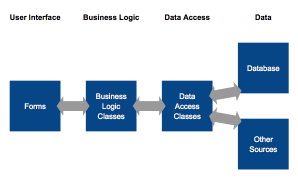

# .NET Review
- [.NET Review](#net-review)
    - [Lecture 1 Linq, enterprise dev practice](#lecture-1-linq-enterprise-dev-practice)
        - [Namespace naming conventions](#namespace-naming-conventions)
        - [LINQ Language INtegrated Query](#linq-language-integrated-query)
    - [Lecture 2 Testing and Refactoring](#lecture-2-testing-and-refactoring)
        - [test approaches](#test-approaches)
        - [Test Driven Development (TDD)](#test-driven-development-tdd)
        - [Dealing with dependencies](#dealing-with-dependencies)
    - [Lecture 3 ASP.NET](#lecture-3-asp-net)
        - [ASP.NET](#asp-net)
        - [Web Server](#web-server)
        - [ASP](#asp)
        - [ASP.NET WebForms:](#asp-net-webforms)
        - [Web.config](#web-config)
        - [Events](#events)
        - [State](#state)
        - [Redirect](#redirect)
    - [Lecture 4 More ASP.NET WebForms and Architecture](#lecture-4-more-asp-net-webforms-and-architecture)
        - [Page life-cycle](#page-life-cycle)
        - [Life-cycle events](#life-cycle-events)
        - [Request and Response](#request-and-response)
            - [a note on testing](#a-note-on-testing)
        - [Redirect vs Transfer](#redirect-vs-transfer)
        - [Sessions and Cookies](#sessions-and-cookies)
        - [Authentication/Authorization](#authentication-authorization)
        - [Master pages](#master-pages)
        - [User controls](#user-controls)
        - [Application architectures](#application-architectures)
    - [Lecture 5 Data Access](#lecture-5-data-access)


## Lecture 1 Linq, enterprise dev practice
### Namespace naming conventions
```cs
CompanyName.TechnologyName[.Feature][.Subnamespace]
```
E.g.

```cs
Westdale.PlanManager.WebFrontEnd
```

### LINQ Language INtegrated Query
- SQL could be executed from C# using strings: `db.ExecuteSQL(@”some sql“);`

Advantages of LINQ:
- Behind the scenes conversion to SQL
- Works with non-SQL data sources as well

Prerequisites for LINQ:
- Lambda expressions
- Implicit typing
- Anonymous types
- Extension functions

Delegates (Named method):
- Allows functions to be used as a variable
- Like function pointers but object oriented, type safe and can be associated with specific instance
```cs
public delegate string Formatter(int value)
public static string SthFormat(int value)
public static void foo(Formatter format){
format(1);
}
foo(SthFormat);
```

Anonymous methods:
- unnamed methods, designed to be used with a delegate type.
- the compiler creates an ordinary method with an auto generated name
```cs
Main() {
  Formatter binary = delegate (int x)
  {
    return Convert.ToString(x, 2);
  };
  foo(binary);
}
```

Lambda Expressions:
```cs
Formatter binary = x => Convert.ToString(x, 2);
foo(binary);
```
- Read as “x goes to …” or “input x returns …”

Alternate syntax (Lambda):
```cs
Func<int, string> toBinary = x => Convert.ToString(x, 2);
Func<int, int, int> add = (x, y) => x + y;
Func<int, int, int> subtract = (int x, int y) => x - y;
Func<int, int, int> multiply = (int x, int y) =>
{
  int result = x*y;
  return result;
}
```

Anonymous types:
```cs
var user = new {Name = “Carol”, Age = 35};
```
- Use var
- No class name after new
- Properties names are used in braces {}, read only
- Compiler automatically generates a class of readonly properties

Implicitly typed variables:
- Use var, automatically inferred from the expression by compiler
- Variable is strongly typed
- Object Initializers:

```cs
var user = new User {FirstName = “Carol”, LastName = “Brady”};
```

Collection Initializers:
```cs
var names = new List<string> { “Mike”, “Carol”};
```

Extension Methods:
```cs
namespace MyExtensionMethod
{
  public static class StringConversions {
    public static double ToDouble(this string s) {
      return Double.Parse(s);
    }
  }
}

using MyExtensionMethod;
…
{
  {
    string myString = “6”;
    Console.WriteLine(myString.ToDouble());
  }
}
```
- A static method declared in a static class (first parameter is modified by “this”)
- Called as an instance method of a different class motivation
- “Add” methods to existing types without creating a new derived type
- Share “interface implementation”
- Allow capabilities to be extended (e.g. LINQ) with a simple using statement

what is the point?
- Extension methods allow interfaces (such as IEnumerable and IQueryable) to have implementation

LINQ:
```cs
var namesOfVoters = from c in db.Users
                    where c.Age >= 18
                    select c.LastName;
foreach (var name in namesOfVoters)
{
  Console.WriteLine(name);
}
```

LINQ can query:
- collections/arrays
- databases
- XML
- your own sources

LINQ method syntax:

```cs
var result = numbers.Where(x => x > 5).Select(x => x * x);
```

- the results are available as an IEnumerable<T> collection

## Lecture 2 Testing and Refactoring
### test approaches
black box testing
- when we test the inputs and outputs, but do not look inside
- we check that the system follows its specifications

White box testing
- when we look inside the system as part of the testing
- use our knowledge of the system's internals to test the behaviour
we use **Unit tests, Automated, White box**

### Test Driven Development (TDD)
1. write an automated test that fails
2. write just enough code to get it passing
3. rafactor your code to imporve maintainability

how does this help?
- prevents over-engineering and adding untested behaviours

.NET testing with MSTest:

```cs
[TestClass]
public class UsersTests
{
  [TestMethod]
  public void FullName_Male_StartsWithMr(){
    User user = new User ("Mike", Gender.Male);
    Assert.IsTrue(user.FullName().StartsWith("Mr"), "error msg");
  }
}
```

Test naming convention
- tests for MyProject -> MyProjectTests
- tests for MyClass -> MyClassTests
- individual tests are named [Unit]\_[State]\_[Result]

E.g.
```cs
CalculatorTests::
DivisionTests::
Dividing_FourByZero_Errors
```

Alternate convention
- tests for MyProject -> MyProject.UnitTests
- tests for a unit of work with a spcific state in StateUnderTest
- tests for individual behaviours are simply the behaviour name

E.g.

```cs
Calculator.UnitTests::
DivisionOfTwoNumbers::
Should_throw_an_exception_when_dividing_by_zero
```

Test setup:
`[TestInitialize]` will run before **every** test method

Testing for Exceptions:
`[ExpectedException(typeof(DivideByZeroException))]`
the test will fail if an exception **doesn't** occur

### Dealing with dependencies
your code will often have dependencies on other classes
- file system classes
- database access classes
- web service classes

one appraoch
- class under test uses interface to dependency
- write a dummy interface implementation for testing only
- test code 'injects' fake class
- tests run using the fake class

## Lecture 3 ASP.NET
### ASP.NET
Active Server Pages (ASP).NET
Three Models
- WebForms
  - GUI oriented, using 'forms' and 'controls'
  - a stateful application abstraction over web development
- MVC (Model View Controller)
  - doesn't hide the stateless nature of the web
- Web API
  - supports REST/HTTP APIs
  - very similar approach to MVS

### Web Server
browser <-> server
- HTTP protocol
- TCP port 80 or 443 for HTTPS

Serving static content:

**browser <-> server <-> HTML files**

ASP.NET:


### ASP
Classic ASP (inline) style:
```html
<%@ Page Language="C#" %>
<!DOCTYPE html>
<html>
  <body>
    <%
      if (Test())
      {
    %>
      Hello, <%= Expression() %>
    <%
      }
    %>
  </body>
</html>
```

### ASP.NET WebForms:
ASPX:
```html
<%@ Page Language="C#"
    AutoEventWireup="true"
    CodeBehind="User.aspx.cs"
    Inherits="WebApplication.User"  %>
    <!DOCTYPE html>
<html>
<body>
<form runat="server">
        <asp:TextBox ID="FirstName" runat="server">
            </asp:TextBox>
        <asp:Button ID="Button" runat="server"
    </form> Text="Save" OnClick="Button_Click" />
</body>
</html>
```

- server-side controls have a `runat="server"` attribute
- standard ASP.NET controls are prefixed with `asp:`
- server-side event handlers can be defined in the ASPX

Code behind:
```cs
using System;
using System.Web;
using System.Web.UI;
using System.Web.UI.WebControls;
using System.Diagnostics;
namespace WebApplication
{
  public partial class User : System.Web.UI.Page
  {
    protected void Page_Load(object sender, EventArgs e)
    {      
      // initialization
    }
    protected void Button_Click(object sender, EventArgs e)
    {
      Debug.WriteLine(FirstName.Text);
    }
  } 
}
```

- a partial class
- `Page_Load` is called before each page request
- `Button_Click` is called whenever the button is clicked

Designer Class:
- another partial class auto generated by Visual Studio
- it declares the user control

### Web.config
```xml
<appSettings>
  <add key="ValidationSettings:UnobtrusiveValidationMode" value="None"/>
  <add key="MinimumBalance" value="150"/>
</appSettings>
```
```cs
using System.Web.Configuration;
...
string minimumBalanceString = WebConfigurationManager.AppSettings["MinimumBalance"];
int minimumBalance = int.Parse(minimumBalanceString);
```

why is this useful?
- WebConfigurationManager is typically used in web applications where it may deal with hierarchies of web.config files
- the configuration files are on a per-project basis
- a separate App.config file would be needed if used in unit test project

### Events
Multicast events
```cs
Button.Click += Button_Click;

// behind the scene declarations
// in System namespace
public delegate void EventHandler(object sender, EventArgs e);
// in the System.Web.UI.WebControls.Button class
public event EventHandler Click;
```

### State
- Session
  - SessionState is persisted on the server for each browser session
- ViewState
  - ViewState is sent between the server and client on every request

store value in the Session and ViewState object:
```cs
Session["somekey"] = 123;
int value = （int) Session["somekey"];
```

### Redirect
```cs
Response.Redirect("Other.aspx");
Server.Transfer("Other.aspx");
```

`Response.Redirect` is more preferred as `Server.Transfer` does the redirect on the server so may result in misleading URLs
e.g. A request to PageA.aspx, if transferred to PageB.aspx will retain the URL of PageA.aspx.

## Lecture 4 More ASP.NET WebForms and Architecture
### Page life-cycle
High Level understanding:
- requested received
- object instantiated
- page set-up
- `Page_Load` is called
- control events are fired
- response is sent to user

Full page life-cucle:
- Page request
- Start
  - PreInit
- Initialization
  - Init
  - InitComplete
  - PreLoad
- Load
  - Load
- Postback events
  - Control events
  - LoadComplete
  - PreRender
  - PreRenderCoimplete
  - SaveStateComplete
- Rendering
  - Render
- Unload
  - Unload

### Life-cycle events
Three approaches
- AutoEventWireup
```cs
protected void Page_Load(object sender, EventArgs e)
```
if .aspx file having `AutoEventWireup="True"` define in the `<%@Page %>` tag, can write custom event handlers, just by defining a function prefixed by `Page_`
- Delegates
```cs
Load += Listner;
```
programmatically wire up a delegate using event handlers, but may need to do this early (e.g. in constructor)
- Virtual methods
```cs
protected override void OnLoad(EventArgs e)
{
  base.OnInit(e);
}
```
directly override the event methods in `System.Web.UI.Page`, however, it is important to call the base event, otherwise the page may not be rendered properly

### Request and Response
- instance of each is available in a Page
- Request
  - HTTP GET/POST request properties
  - Query string, cookies, parameters
- Response
  - Send HTTP response properties
  - Redirects, cookies, HTML, headers

```cs
// Request
Request.Headers["User-Agent"];
Request.HttpMethod;
Request.Params["Name"];

//Response
Response.Write("<h3>Hello world!</h3>");
Respose.ContentType = "text/plain";
Response.Headers.Add("Debug-Info", "v1.0");
Response.Redirect("Welcome.aspx");
```

#### a note on testing
- Request and Response both interact with HttpContext
- all are static objects
- it is very hard to stub/mock a static object
- tips for unit testing with WebFormsL
  - separate business logic from the page
  - encapuslate interactions with Request and Response
  - consider using an MVP(Model-View-Presenter) pattern (advanced)

### Redirect vs Transfer
`Response.Redirect("Other.aspx")`
- causes HTTP Code 302 to be sent
- browser then requests the page
- all form values, etc from current page are lost

`Server.Transfer("SomePage.aspx")`
- direct transfer (no new request from browser)
- form values can be preserved if required
- URL in browser is unchanged

### Sessions and Cookies
Cookies
- a text file stored on the **client's** computer by the web browser
- the web site uses the cookie to store information about the user
- sent with each request from the user to the web site
- sent as a HTTP header

```cs
HttpCookie cookie = new HttpCookie("user", "Cindy");
cookie.Expires = DateTime.Now.AddMinutes(10.0);
Response.SetCookie(cookie);

Request.Cookies["user"].Value;
```

Limitations:
- can only store strings
- can be disabled by the user
- at least (at most) 300 cookies total
- at least (at most) 4096 bytes per cookie
- at least (at most) 20 cookies per domain

HttpSessionState
- available in every page via `Session`
- stores objects by key (name-value pairs)
- Users cookies behind-the-scenes `ASP.NET_SessionId=...;`
- Fall-back to URL encoding

ViewState
- `ViewState` is similar to `Session`
- implemeted as a hidden form variable (doesn't depend on cookies)
- available on post back (not sessions)
- is transferred with every requet and respose

### Authentication/Authorization
Authentication strategies
- no authentication
- individual user accounts
for general public
- organizational accounts
use with Active Directory
- windows authentication
for small Local Area Network

Authentication technologies
- membership (old)
- identity (new)
- cookie authentication

when first login, login credentials are checked and authentication information is added to browser cookie, so no need to sent credential with every request

Authentication concepts
- Users - individual
- Roles - category
- Claims - store user information
- Authentication - who are u
- Authorization - what r u allowed to do

Getting the current user:
used the `User` Proerty of `System.Web.UI.Page`
```cs
User.Identity.Name
User.IsInRole("Admin")
```

Protecting files/directories:
in web.config
```xml
<location path="Admin.aspx">
  <system.web>
    <authorization>
      <allow roles="Admin"/> 
      <deny users="*" />
    </authorization>
  </system.web>
</location> 
```

- the asterisk (*) means "everyone"
- the question mark(?) means "unauthenticated users"

### Master pages
- use master pages to achieve a common look and feel
- master pages use placeholder tags for positioning nested content
- content pages "inherid" common GUI elements from master pages
- known as "visual inheritance"

Master:
```html
<%@Master Language="C#" %>

<asp:ContentPlaceHolder ID="Main" runat="server"/>
```

Content Pages:
```html
<%@Page Language="C#" MasterPageFile="Site.Master" %>

<asp:Content ContentPlaceHolderID="Main" runat="server">
  Welcome!
</asp:Content>
```

### User controls
web applications often reuse functionality on multiple pages:
- user controls (ASCX) can achieve this
- custom components can be embedded like ordinary components

```html
<%@Control Language="C#" CodeBehind="MyControl.ascx.cs" Inherits="App.MyControl" %>

<asp:TextBox ID="FirstName" runat="server"></asp:TextBox>
<asp:TextBox ID="LastName" runat="server"></asp:TextBox>
```
Content Pages:
```html
<%@Page Language="C#" %>

<%@ Register Src="~/MyControl.ascx" TagPrefix="uc" TagName="MyControl" %> 
<uc:MyControl ID="UserDetails" runat="server"/>
```
### Application architectures
1-tier


Advantages
- Extremely simple

Diadvantages
- difficulty in re-using code if presentation method needs to be changed
- testing is more complex
- difficult to share functionality
- functionally unrelated code is contained in a single class
- no shared data

2-tier


Advantages
- Conceptually simple
- Shared data

Disadvantages
- diffculty in re-using code if presentation method needs to be changed
- testing is more complex
- difficult to share functionality
- functionally unrelated code is contained in a single class

3-tier


Advantages
- easier testing
- easier to modify user interface
- more scalable
- data access classes can be shared with other applications

Disadvantages
- More complex

4-tier


Advantages
- best for testing
- more scalable
- interface classes are only responsible for displaying data (easy to change interface)
- one place to change business logic
- business and data access functions can be chared easily

Disadvantages
- more complex
- less support from IDE tools

## Lecture 5 Data Access